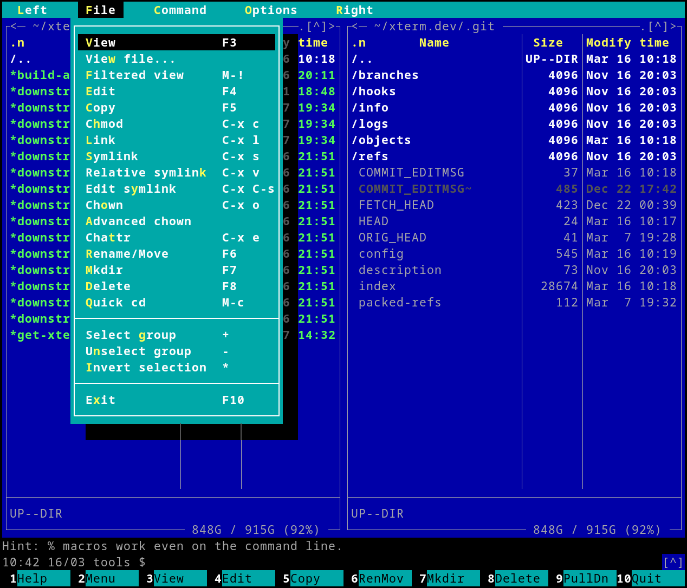

# Welcome to Midnight Commander

[](https://github.com/MidnightCommander/mc/tags)
[](https://github.com/MidnightCommander/mc)
[](https://github.com/MidnightCommander/mc)
[](https://github.com/MidnightCommander/mc/issues)
[](https://github.com/MidnightCommander/mc/pulls)
[](https://github.com/MidnightCommander/mc)

GNU Midnight Commander (or `mc`) is a visual, dual-pane file manager. It is released under the GNU General Public License and therefore qualifies as Free Software.

Midnight Commander is a feature-rich, full-screen, text-mode application that allows you to copy, move, and delete files and entire directory trees, search for files, and execute commands in the subshell. Internal viewer, editor and diff viewer are included.

`mc` uses versatile text interface libraries such as [ncurses](https://invisible-island.net/ncurses/) or [S-Lang](https://www.jedsoft.org/slang/), which allows it to work on a regular console, inside an X Window terminal, over `ssh` connections, and in all kinds of remote shells.



## Installation

The easiest way to install `mc` is to use your system package manager:

=== "Debian / Ubuntu"

    ```
    # apt-get install mc
    ```

=== "Fedora / Red Hat"

    ```
    # dnf install mc
    ```

=== "FreeBSD"

    ```
    # pkg install mc
    ```

=== "macOS"

    ```
    % brew install midnight-commander
    ```

Our source releases are kindly [mirrored by OSU OSL]({{ extra.downloads_url }}/?C=N;O=D). Our canonical repository is hosted [on GitHub]({{ config.repo_url }}). See the [Source code](source-code.md) page for details.

## Documentation

The primary way to learn about `mc` is to use the context-sensitive online help available via ++f1++.

We also have extensive manual pages, which are the primary source of official documentation:

=== "mc"

    ```
    $ man mc
    ```

    ... or read the latest [development version]({{ extra.man_url }}/mc.html) online.

=== "mcedit"

    ```
    $ man mcedit
    ```

    ... or read the latest [development version]({{ extra.man_url }}/mcedit.html) online.

=== "mcview"

    ```
    $ man mcview
    ```

    ... or read the latest [development version]({{ extra.man_url }}/mcview.html) online.

=== "mcdiff"

    ```
    $ man mcdiff
    ```

    ... or read the latest [development version]({{ extra.man_url }}/mcdiff.html) online.

## Contributing & support

* For support, see the [Communication](communication.md) page.
* To contribute to `mc`, proceed to the ["Development" section](source-code.md).
* Release notes for the development version are collected on the [wiki]({{ config.repo_url }}/wiki).
